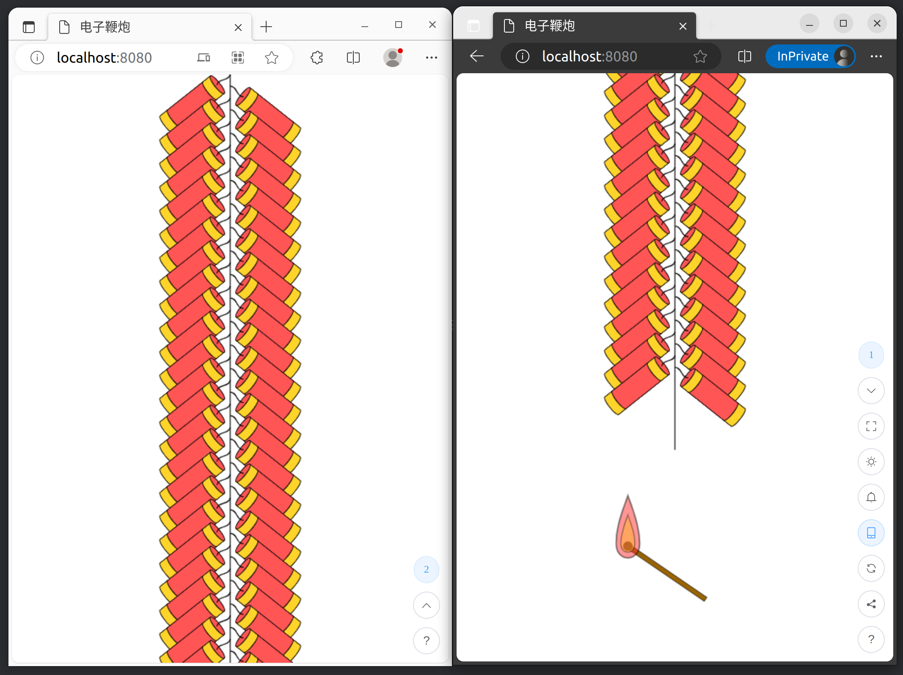
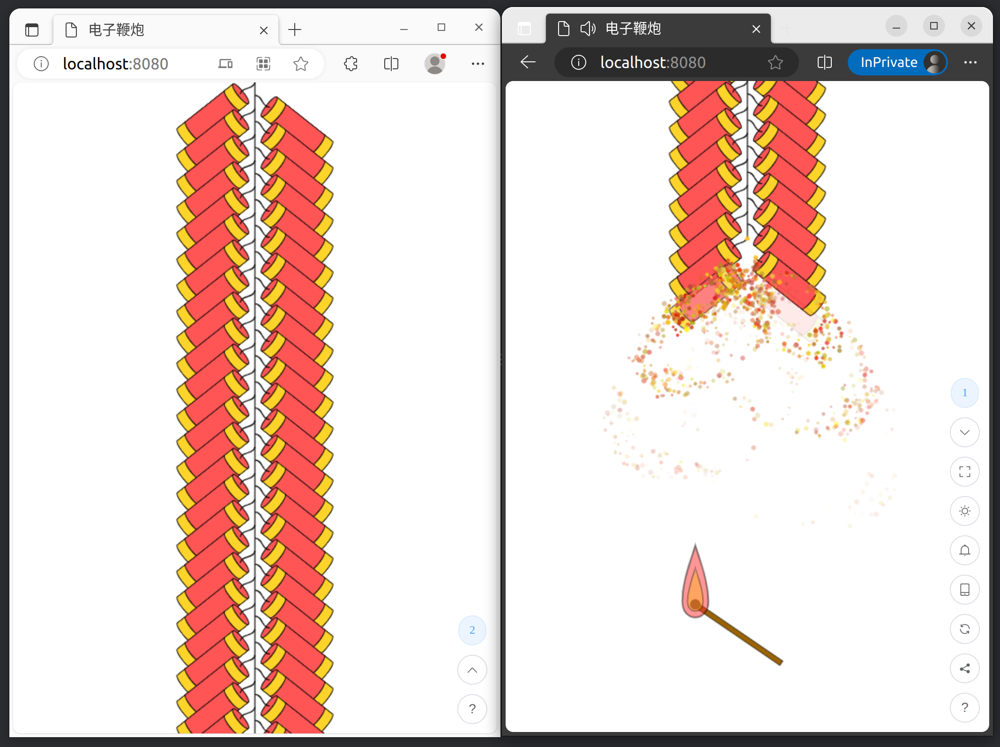

# 电子鞭炮

项目原地址：(https://gitee.com/dreamagician/electronic-firecrackers)

## 介绍

这是一个模拟鞭炮燃放的网页小游戏，基于SpringBoot和Vue3开发，鞭炮可以在多个屏幕上按顺序燃放，就像它们连在一起一样

## 获取和使用

本项目提供了jar和exe格式的可执行文件，可以在[发行版](https://gitee.com/dreamagician/electronic-firecrackers/releases)中下载  
无需安装，启动成功后使用浏览器访问`http://localhost:8080`即可开始游玩  
点击页面右下角`?`按钮可以查看更多帮助

## 配置

可以使用SpringBoot的application.yml配置文件进行配置，以下是本项目自有的配置项

- application.login-required

是否需要登陆，默认为`false`

- application.username

用户名，默认为`user`，当`application.login-required`为`true`时有效

- application.password

密码，默认为`password`，当`application.login-required`为`true`时有效

- application.urls

出现在“分享”功能中的url，默认为`auto`，可以以列表格式设置多个url，如果设置为`auto`，会根据ip地址和端口号自动生成

## 从源码构建

### 环境要求

- JDK（>=17）
- maven
- nodejs
- npm

### 构建

Windows：运行`scripts/build.bat`脚本  
Linux：运行`scripts/build.sh`脚本